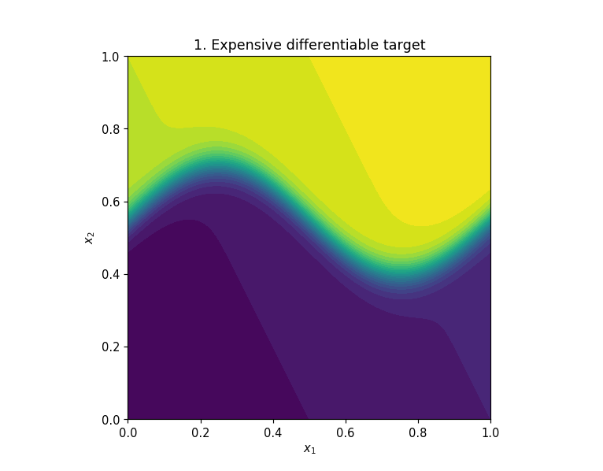
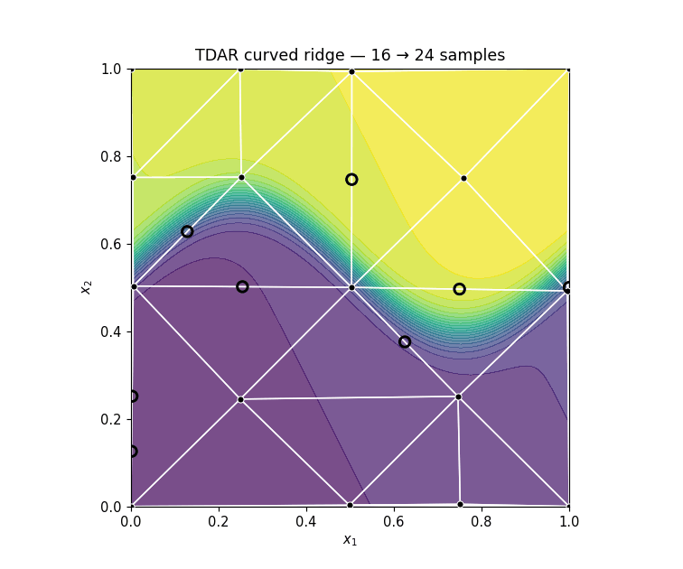
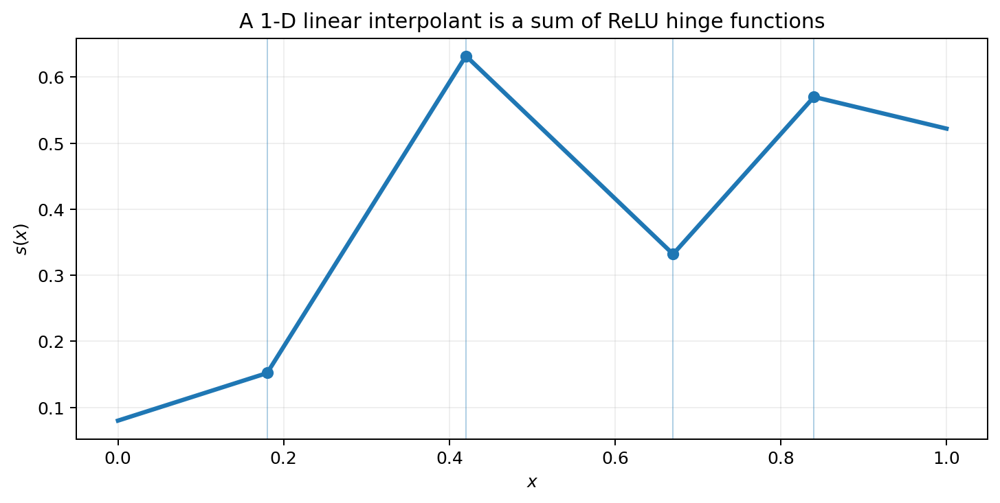
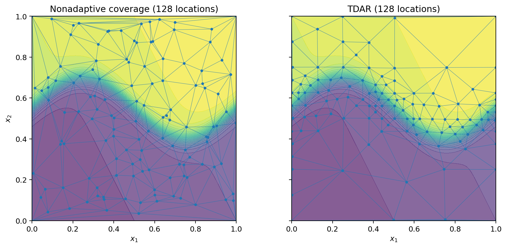
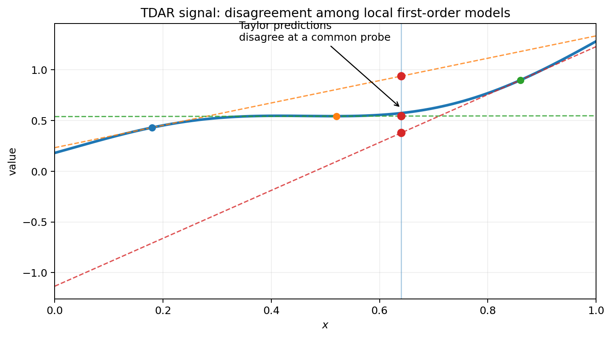
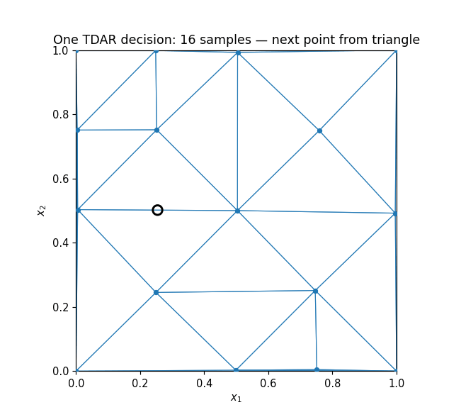
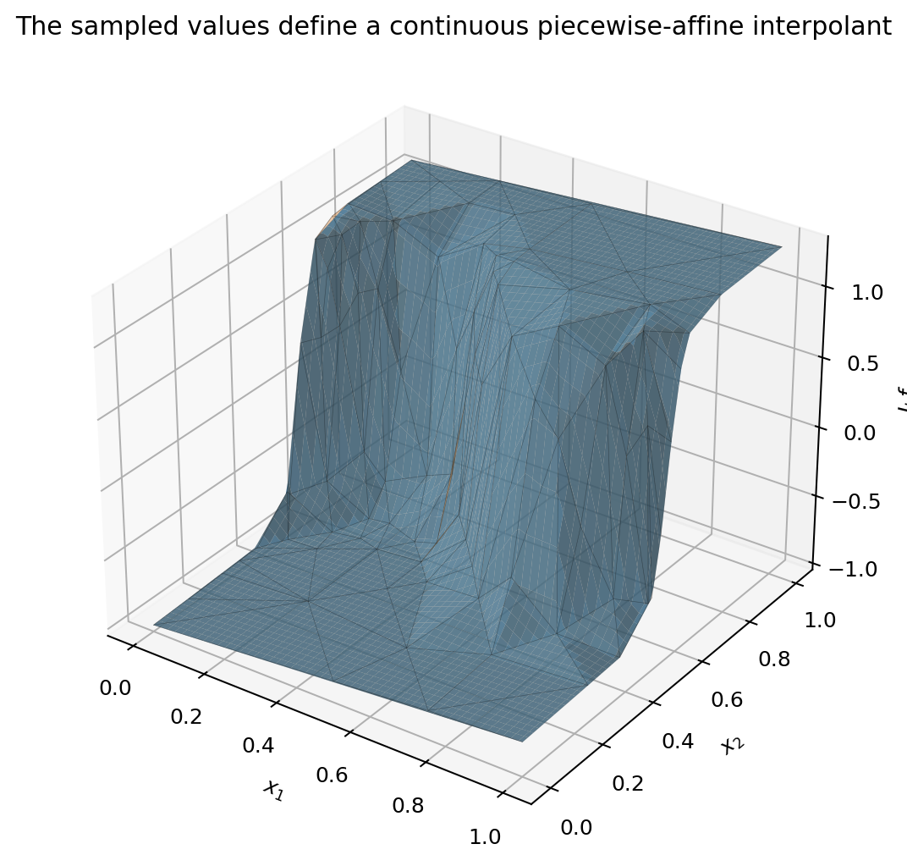

# TDAR

**Taylor-Disagreement Adaptive Refinement** is a derivative-informed adaptive sampling method for constructing accurate low-dimensional piecewise-affine surrogates of expensive smooth functions.

The motivating pipeline is numerical rather than statistical:

> **expensive differentiable model → adaptive first-order samples → piecewise-affine interpolant → ReLU representation → dense accelerator evaluation**



A continuous piecewise-affine (CPWA) interpolant is attractive because it is simple, local, deterministic, and admits an exact representation by ReLU networks. The long-term use case is therefore to spend expensive model evaluations **offline** to discover where resolution is needed, construct the CPWA approximation, compile that approximation into ReLU form, and evaluate it cheaply and regularly on accelerators such as TPUs.

**This repository currently implements the adaptive sampling stage.** It does not yet contain the CPWA-to-ReLU compiler or TPU runtime. Those are the downstream motivation, not a capability being claimed here.

---

## 1. The numerical problem

Let

$$
f:\Omega\subset\mathbb{R}^2\rightarrow\mathbb{R},
$$

where evaluating $f$ is expensive but first-order information is available through an analytic derivative, adjoint, automatic differentiation, or numerical differentiation.

We want a design

$$
X_N=\{x_i\}_{i=1}^N
$$

that supports an accurate surrogate with as few expensive observations as possible. For the present TDAR v1 implementation, $\Omega=[0,1]^2$ and the downstream surrogate used in the benchmarks is the continuous piecewise-linear interpolant over the Delaunay triangulation of $X_N$.

The central difficulty is not evaluating the interpolant once it exists. It is deciding **where the expensive model should be sampled**.



The curved-ridge problem makes that distinction visible: most of the square is easy, while a narrow curved region requires substantially more resolution.

---

## 2. Why piecewise-affine interpolation leads naturally to ReLU

Start in one dimension. Let a continuous piecewise-linear interpolant have breakpoints

$$
\xi_1<\xi_2<\cdots<\xi_m
$$

and successive slopes $s_0,s_1,\ldots,s_m$. Then it can be written exactly as

$$
p(x)=a+s_0x+\sum_{k=1}^{m}(s_k-s_{k-1})\mathrm{ReLU}(x-\xi_k),
$$

where

$$
\mathrm{ReLU}(z)=\max(0,z).
$$

Each ReLU is simply a **hinge basis function**. Crossing a breakpoint changes the slope by the corresponding coefficient.



This is useful conceptually: the ReLU network is not being introduced as a mysterious learned model. It is another representation of a piecewise-affine numerical approximant.

The same structural fact extends to higher dimensions: continuous piecewise-affine functions on polyhedral subdivisions can be represented by finite ReLU networks. The representation problem is more involved than the 1-D hinge formula, but the important computational consequence is the same: after construction, evaluation can be expressed using affine maps and elementwise ReLUs rather than geometric point-location followed by simplex interpolation.

That distinction motivates the project:

- **construction time:** use geometry, derivatives, Delaunay triangulations, and adaptive decisions on the CPU;
- **deployment time:** evaluate a compiled ReLU representation using regular accelerator operations.

For TPU-oriented workloads, the second stage is appealing because dense affine operations and elementwise nonlinearities fit accelerator execution much better than irregular mesh traversal. TDAR is intended to make the *construction* of that approximant economical in expensive-function evaluations.

---

## 3. Why uniform resolution is wasteful

A space-filling design treats every part of the domain as if it deserves comparable resolution. That is appropriate when unresolved structure is distributed throughout the domain, but inefficient when the difficult region is localized.



TDAR asks a different question:

> **Where do the first-order models we already possess cease to agree with one another?**

If that disagreement is concentrated, the sample design should become concentrated too.

---

## 4. The Taylor-disagreement indicator

Suppose a triangle $T$ has vertices $x_1,x_2,x_3$. At each sampled vertex we know

$$
f_i=f(x_i),\qquad g_i=\nabla f(x_i).
$$

The first-order Taylor model based at vertex $i$ is

$$
\mathcal{T}_i(p)=f_i+g_i^T(p-x_i).
$$

TDAR evaluates these local models at a small common set of probe points $p$ inside the triangle. At a probe, define the mean prediction

$$
\overline{\mathcal{T}}(p)
=\frac{1}{3}\sum_{i=1}^{3}\mathcal{T}_i(p)
$$

and the disagreement

$$
d_T(p)=
\left[
\frac{1}{3}\sum_{i=1}^{3}
\left(\mathcal{T}_i(p)-\overline{\mathcal{T}}(p)\right)^2
\right]^{1/2}.
$$

The triangle indicator is

$$
\eta_T=\max_{p\in P_T}d_T(p),
$$

where $P_T$ is the fixed probe set consisting of the centroid and edge midpoints in TDAR v1. Convex-hull edges receive an analogous two-vertex indicator.



For an affine function,

$$
f(x)=a+b^Tx,
$$

all first-order Taylor models reproduce $f$ exactly everywhere, so the disagreement vanishes. Nonzero disagreement therefore measures a failure of local affine consistency.

For a smooth nonlinear function, Taylor expansion gives the scale

$$
f(x_i+\delta)
=f(x_i)+\nabla f(x_i)^T\delta
+\frac{1}{2}\delta^TH_f(\xi)\delta,
$$

so Taylor-model disagreement is naturally driven by curvature and scales like

$$
\eta_T=O(\|H_f\|h_T^2)
$$

on a triangle of diameter $h_T$, under the usual smoothness assumptions. This mirrors the familiar second-order local scale of linear interpolation error.

**TDAR does not claim that $\eta_T$ is a certified a posteriori error estimator.** It is a derivative-informed refinement indicator whose purpose is to rank unresolved regions without evaluating the true error there.

---

## 5. Refinement geometry

At each iteration TDAR:

1. forms the Delaunay triangulation of the current sample set;
2. computes Taylor-disagreement indicators for triangles and convex-hull edges;
3. places triangles and boundary edges in a common priority ordering;
4. selects new points by local maximin placement in the highest-priority entities;
5. applies scale-aware boundary closure when an unresolved boundary edge competes with an adjacent triangle;
6. uses deterministic global farthest-point filling if an adaptive batch cannot be completed; and
7. evaluates the first-order oracle at the accepted new points and retriangulates.



The method therefore separates two ideas that are often conflated:

- the **indicator** decides *where resolution is missing*;
- the **placement rule** decides *where inside that region the next sample should go*.

The current implementation uses a barycentric candidate lattice and a local maximin rule for the latter.

---

## 6. From samples to a CPWA surrogate

Once values are known at the selected sites, the Delaunay triangulation defines the usual nodal piecewise-affine interpolant $I_hf$. On each triangle $T$,

$$
(I_hf)|_T(x)=a_T+b_T^Tx,
$$

with coefficients chosen to reproduce the three vertex values. Continuity follows from agreement of the nodal interpolants on shared edges.



Notice that TDAR uses gradients to **choose the mesh**, but the benchmark surrogate itself uses only the sampled function values. This is deliberate: first-order information guides construction without forcing the deployed surrogate to carry derivative data.

The next architectural stage is to convert this CPWA function into an exact ReLU representation. That compiler is intentionally outside TDAR v1, but it is the principal deployment motivation for the project.

---

## 7. Why this can matter for TPU deployment

A triangulated interpolant is inexpensive by the standards of the original model, but direct evaluation still involves irregular operations: point location, simplex selection, and simplex-specific affine coefficients.

A compiled ReLU representation changes the execution model. In schematic form,

$$
x\mapsto W_L\sigma\!\left(W_{L-1}\sigma\left(\cdots\sigma(W_1x+b_1)\right)+b_{L-1}\right)+b_L,
$$

with $\sigma(z)=\max(0,z)$ applied elementwise.

The construction problem and the deployment problem can therefore be optimized separately:

| Stage | Primary concern | Natural machinery |
|---|---|---|
| Offline sampling | expensive oracle calls | TDAR, gradients, triangulation |
| Interpolant construction | approximation fidelity | CPWA finite-element geometry |
| Compilation | exact representation | CPWA → ReLU transformation |
| Deployment | throughput | dense accelerator kernels / TPU |

The numerical-analysis question addressed here is the first one: **how should we spend the expensive oracle calls so the eventual CPWA/ReLU surrogate resolves the important structure?**

---

## 8. What the benchmarks say

There are two benchmark questions, and they should not be confused.

### 8.1 Sample-location efficiency

The first benchmark gives every method the same number of sampled locations. Random, Latin hypercube, and Sobol designs use function values; TDAR additionally receives first-order information for refinement. Every method is evaluated with the same value-only piecewise-linear Delaunay surrogate on the same held-out points.

On the curved ridge, TDAR initially pays for its starting geometry, then rapidly concentrates resolution along the difficult feature. At 256 locations the canonical run gives RMSE approximately

| Method | Ridge RMSE, 256 locations |
|---|---:|
| Random | 0.1117 |
| LHS | 0.1072 |
| Sobol | 0.0953 |
| TDAR | **0.0137** |

This experiment measures **where the locations are spent when first-order information is available**. It does not claim equal derivative cost.

### 8.2 Oracle-call efficiency

The second benchmark makes derivative acquisition explicit. A value-only baseline costs one scalar function call per location. In two dimensions:

- forward-difference TDAR costs 3 calls per sampled location;
- central-difference TDAR costs 5 calls per sampled location.

The canonical finite-difference step is $h=10^{-3}$, selected after a float64 sensitivity sweep from $10^{-2}$ through $10^{-6}$. The refinement decisions were broadly insensitive to this range; central differences were especially stable.

Representative RMSE values from the canonical cost-normalized run are:

| Problem / calls | Sobol | TDAR forward FD | TDAR central FD |
|---|---:|---:|---:|
| curved ridge / 192 | 0.1070 | **0.0844** | 0.1989 |
| curved ridge / 768 | 0.0502 | **0.0136** | 0.0295 |
| quadratic / 192 | 0.0683 | **0.0256** | 0.0582 |
| quadratic / 768 | 0.0252 | **0.00418** | 0.00869 |
| multiscale / 192 | **0.0270** | 0.0718 | 0.1614 |
| multiscale / 768 | **0.00826** | 0.0157 | 0.0259 |

The multiscale case is important. TDAR is **not** universally superior after derivative cost is charged. When difficult structure is distributed enough that broad coverage remains valuable, Sobol can make better use of the same total number of function calls.

The ridge and quadratic cases show the opposite regime: once the refinement signal becomes informative enough, spending calls on approximate gradients can pay for itself by avoiding many low-value locations.

A useful empirical conclusion from these experiments is that **gradient accuracy and gradient usefulness are different questions**. Forward differences generally outperform central differences under equal call budgets because TDAR benefits more from additional first-order locations than from paying extra calls for more accurate gradients.

---

## 9. Using TDAR

The numerical core is framework-neutral. TDAR consumes a first-order oracle

$$
x\mapsto \bigl(f(x),\nabla f(x)\bigr).
$$

For example, with an analytic NumPy oracle:

```python
import numpy as np
from tdar import farthest_point, sample


def oracle(x):
    x0, x1 = x
    value = x0**2 + 4.0*x1**2
    gradient = np.array([2.0*x0, 8.0*x1])
    return value, gradient


result = sample(
    oracle,
    farthest_point(16),
    budget=128,
)

X = result.points
values = result.values
```

JAX is an optional adapter rather than a core dependency:

```python
import jax.numpy as jnp
from tdar import farthest_point, jax_oracle, sample


def f(x):
    center = 0.55 + 0.15 * jnp.sin(2.0 * jnp.pi * x[0])
    return 0.2*x[0] + 0.1*x[1] + jnp.tanh(20.0*(x[1] - center))


result = sample(
    jax_oracle(f),
    farthest_point(16),
    budget=128,
)
```

The returned gradients are available as `result.gradients`, but TDAR does not prescribe the downstream surrogate.

---

## 10. Reproducing the visuals and experiments

Install the development environment:

```bash
python3 -m venv .venv
source .venv/bin/activate
python -m pip install -e '.[dev,jax]'
```

Run the tests:

```bash
python -m pytest -v
```

Regenerate the README assets:

```bash
python examples/visualization/animate_curved_ridge.py
python examples/visualization/generate_readme_assets.py
```

Run the sample-location benchmark:

```bash
python benchmarks/run_benchmarks.py
```

Run the cost-normalized benchmark:

```bash
python benchmarks/run_cost_benchmarks.py
```

Run the finite-difference sensitivity experiment separately:

```bash
python benchmarks/run_fd_sensitivity.py
```

The cost benchmark forces float64 evaluation and records its precision, finite-difference scheme, step size, sample locations, and actual scalar function-call accounting in the output metadata.

---

## 11. Scope and limitations

TDAR method v1 is intentionally narrow.

- scalar functions of two variables;
- unit-square domain;
- first-order information supplied by the oracle;
- Delaunay geometry;
- deterministic refinement for fixed configuration;
- no certified error bound;
- no higher-dimensional claim;
- no claim that adaptive sampling dominates space-filling designs on every function;
- no CPWA-to-ReLU compiler in this repository yet;
- no TPU runtime in this repository yet.

Higher dimensions are not a trivial extension: Delaunay complexity, candidate placement, geometric robustness, and the economics of derivative acquisition all change with dimension. The present library should therefore be read as a deliberately controlled 2-D numerical method, not as an automatically scalable high-dimensional sampler.

---

## 12. Repository layout

```text
src/tdar/                 frozen TDAR v1 numerical library
src/tdar/adapters/        optional derivative-framework adapters
examples/                 executable numerical examples
examples/problems/        demonstration functions
examples/visualization/   reproducible README figures and animations
benchmarks/               location- and cost-normalized experiments
tests/                    behavior and regression tests
docs/                     method notes and generated assets
```

The algorithm is frozen as **TDAR method v1**. The Python API remains pre-1.0 while it is exercised as a reusable scientific-computing dependency.

## License

GPL-3.0-or-later.
